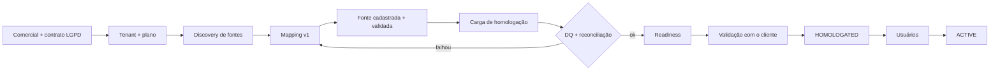

# Onboarding técnico de um cliente — W2Health (Fase 2)

Roteiro **operacional** para colocar uma operadora no ar com dados próprios. Desde a Fase 2
o caminho de **arquivo** está implementado de ponta a ponta (fonte → RAW → mapping → DQ →
Silver → Gold → reconciliação → readiness), com estado de onboarding persistido por tenant
(`tenant_onboarding`). Conectores de banco/API **não** existem ainda.

Estados (automáticos até `CAPABILITIES_READY`; os dois últimos são decisões humanas
auditadas): `TENANT_CREATED → SOURCE_REGISTERED → CONNECTION_VALIDATED → RAW_LOADED →
MAPPING_VALIDATED → DATA_QUALITY_VALIDATED → SILVER_READY → GOLD_READY → RECONCILED →
CAPABILITIES_READY → HOMOLOGATED → ACTIVE`.

## Checklist (20 passos)

| # | Passo | Quem | Como / onde | Evidência |
|---|---|---|---|---|
| 1 | Contrato e base legal (operador de dados, LGPD art. 11), canal de envio aprovado | Comercial + jurídico | fora do sistema | contrato assinado |
| 2 | Criar o tenant com o plano contratado | SUPER_ADMIN | Admin → Tenants | `tenant.created` na auditoria; onboarding `TENANT_CREATED` (criado no primeiro acesso ao onboarding) |
| 3 | Conferir features do plano e overrides | SUPER_ADMIN | Admin → Tenants → Features | lista de features contratadas |
| 4 | Discovery de fontes com a TI do cliente | Works2Data + cliente | [SOURCE_DISCOVERY_TEMPLATE.md](SOURCE_DISCOVERY_TEMPLATE.md) | template preenchido |
| 5 | Entregar ao cliente os requisitos de dados | Works2Data | [CLIENT_DATA_REQUIREMENTS.md](CLIENT_DATA_REQUIREMENTS.md) | e-mail/ata |
| 6 | Registrar as decisões de negócio do tenant (seção abaixo) | Works2Data + cliente | registro de onboarding | decisões datadas |
| 7 | Escrever o mapping `<id>_v1.yaml` | Engenharia de dados | [MAPPING_FRAMEWORK.md](MAPPING_FRAMEWORK.md) | PR com o mapping |
| 8 | Validar o mapping (testes + revisão) | Engenharia de dados | `pytest tests/test_data_platform_unit.py`; `parse_mapping` | suíte verde |
| 9 | Cadastrar a fonte FILE apontando o mapping | SUPER_ADMIN | Admin → Integrações → Nova fonte | `SOURCE_REGISTERED` |
| 10 | Validar a fonte | SUPER_ADMIN | Integrações → Validar | `CONNECTION_VALIDATED` |
| 11 | Receber o pacote de **homologação** (≥ 13 competências) | Cliente | canal acordado | arquivos recebidos |
| 12 | Processar a carga | SUPER_ADMIN | Integrações → Importação controlada (ou `cli ingest`) | ingestão com estágio e status |
| 13 | Se `FAILED`: ler DQ/reconciliação, corrigir mapping **ou** pedir correção ao cliente e reenviar | Engenharia de dados | Integrações → Detalhes | nova ingestão |
| 14 | Conferir Data Quality (WARNING/INFO, coberturas) e registrar aceite dos avisos | Engenharia de dados | Detalhes → Data Quality | `DATA_QUALITY_VALIDATED` |
| 15 | Conferir reconciliação origem × Silver × Gold | Engenharia de dados | Detalhes → Reconciliação | todas PASS (ou WARNING justificado) → `RECONCILED` |
| 16 | Conferir capability readiness (contratada × dados prontos × disponível) | SUPER_ADMIN | Integrações → Capabilities | `CAPABILITIES_READY`; motivos dos itens `NOT_READY` comunicados |
| 17 | Validar indicadores com o cliente: totais por competência (eventos, apresentado, receita) contra o relatório oficial dele + 2–3 casos conhecidos | Works2Data + cliente | telas do produto (seletor "Ambiente" do cabeçalho — acesso de plataforma auditado) + lineage | ata de validação |
| 18 | Homologar | SUPER_ADMIN | Integrações → Onboarding → Homologar (nota obrigatória) | `HOMOLOGATED` + `integration.onboarding_decision` |
| 19 | Criar o administrador do tenant (MFA conforme política) e branding | SUPER_ADMIN / admin do tenant | Admin → Usuários; Gestão → Identidade | convite enviado |
| 20 | Ativar e combinar a rotina de atualização mensal | SUPER_ADMIN | Onboarding → Ativar (nota obrigatória) | `ACTIVE`; calendário de envios |

## Decisões de onboarding a registrar (por tenant)

- **Competência**: de *atendimento*, *apresentação* ou *pagamento*? Se o arquivo não trouxer
  a competência, o contrato operacional usa o mês de `data_evento` — registrar a escolha.
- **Valor pago**: vem pronto ou é derivado (`apresentado − glosado`)?
- **Coparticipação**: vem por evento? Se não, fica 0 (cobertura registrada no DQ).
- **Limite de rejeição** (`max_rejected_ratio`): padrão 0. Aumentar só com aceite explícito.
- **Tolerâncias de reconciliação**: padrão 0. Mudança exige justificativa.
- **Glosa tardia / reprocessamento**: quais competências podem ser reenviadas.
- **Vínculo beneficiário↔contrato**: estado atual (é o que a Silver guarda nesta fase).
- **Pseudonimização**: responsabilidade do cliente antes do envio.
- **Retenção e eliminação** ao fim do contrato.

## Ambiente de demonstração

`vida-plena-csv` foi carregado exatamente por este caminho (passos 9–16) com o pacote de
exemplo; `homolog-csv` foi carregado pela API dentro do Docker Compose. Ver
[DEMO.md](DEMO.md) §Fase 2.
