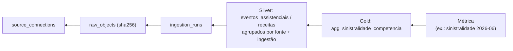

# Linhagem de dados — W2Health (Fase 2)

Pergunta que precisa ter resposta: **"de onde veio este número?"** — da métrica na tela até
o arquivo original recebido. Código: `backend/app/data_platform/lineage.py`.

## 1. Linhagem por linha (Silver)

Todas as tabelas canônicas (`regioes`, `planos`, `contratos`, `especialidades`,
`procedimentos`, `prestadores`, `diagnosticos`, `beneficiarios`, `receitas`,
`eventos_assistenciais`) têm (`LineageMixin`):

| Coluna | Conteúdo |
|---|---|
| `source_system` | rótulo da origem (`generic_csv`, `synthetic_generator`, …) |
| `source_connection_id` | fonte cadastrada |
| `ingestion_run_id` | execução que gravou/atualizou a linha por último |
| `source_record_id` | identidade na origem (eventos: índice único parcial `(tenant_id, source_system, source_record_id)`) |

A migration `f4c5d6e7a8b9` preencheu as linhas pré-existentes como `synthetic_generator`
(Caminho A), sem apagar nada.

## 2. Linhagem por ingestão

`ingestion_runs` → `raw_objects` (chave, sha256, linhas) → `source_connections`; mais
`pipeline_runs.steps` (passo, status, duração, contagens), `data_quality_results` e
`reconciliation_results` da mesma ingestão.

## 3. Consultas disponíveis

| Onde | O quê |
|---|---|
| `GET /api/admin/tenants/{t}/lineage?competencia=AAAA-MM` | Gold da competência + Silver agrupada por (fonte, ingestão) + detalhe de cada ingestão com seus objetos RAW |
| `GET /api/admin/tenants/{t}/ingestion-runs/{id}` | passos, DQ, reconciliação, objetos RAW, fonte |
| Admin → Integrações → "Lineage" / "Detalhes" | as mesmas respostas na interface |
| `python -m app.data_platform.cli lineage --tenant … --competencia …` | idem, em JSON |
| Usuário do cliente: botão ⓘ dos KPIs (`/meta/transparencia`) | fonte da última carga publicada e fontes ativas (sem detalhes técnicos internos) |

Testes: `test_lineage_da_metrica_ate_o_raw` (a métrica chega à Gold, à Silver com
`source_system` da fonte, à ingestão FILE e aos objetos RAW sob o prefixo do tenant) e
`test_raw_rastreavel_e_integro` (sha256 do RAW = sha256 do arquivo enviado). A igualdade
Silver × Gold é garantida pela reconciliação ([RECONCILIATION.md](RECONCILIATION.md)).

## 4. Limites

- Linhagem de **linha** é "última ingestão que tocou" (dimensões em UPSERT): o histórico de
  versões de um beneficiário não é mantido (não há SCD2 nesta fase).
- Gold é agregada — a linhagem da Gold é por competência, via Silver.
