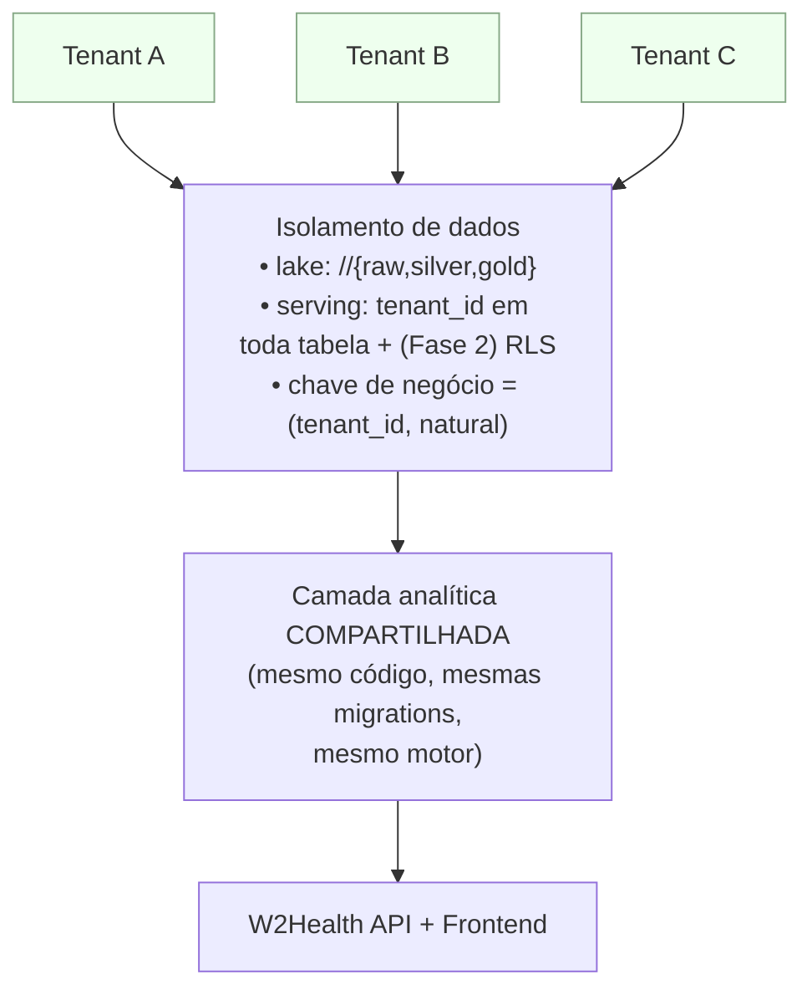

# Arquitetura da Data Platform — W2Health (v1.2)

> **Estado atual:** definição arquitetural + contratos + SQL de referência. **Nenhum
> pipeline roda**, nenhum conector real existe. Este documento é o alvo para quando a
> integração com um cliente real começar.

## 1. Duas plataformas, responsabilidades separadas

| | **DATA PLATFORM** | **APPLICATION PLATFORM** |
|---|---|---|
| Responsável por | ingestão, dado bruto, histórico, padronização, qualidade, transformação, dados analíticos, **segregação por cliente**, rastreabilidade | API FastAPI, frontend, configuração, regras de alerta, (futuro) usuários/preferências, execução das consultas analíticas, **serving** |
| Persistência | Object Storage (data lake) + engine de transformação + warehouse/serving | PostgreSQL (aplicação + serving + configuração) |
| Estado na v1.2 | contratos + SQL de referência (`data_platform/`), tabelas de controle vazias | **funcionando** — é o produto atual |

**O PostgreSQL da aplicação NÃO é o repositório bruto definitivo.** Ele é, hoje:
banco da aplicação + banco de serving analítico (`agg_*`) + banco de configuração
(`regras_alerta`). O histórico bruto e a integração vivem no data lake.

## 2. Camadas lógicas (cloud-agnostic)

```mermaid
flowchart LR
  subgraph SRC["Fontes do cliente"]
    MV[MV / Tasy / Benner]:::src
    ERP[ERP / faturamento]:::src
    FILE[Arquivos / TISS]:::src
    API[APIs / SQL]:::src
  end
  SRC --> ING["Camada de Ingestão\n(conector + mapping)"]
  ING --> RAW["RAW / BRONZE\ndado original + metadados\n(tenant, origem, hash, ingestão)"]
  RAW --> SILVER["SILVER\nMODELO CANÔNICO W2HEALTH\n(data_platform/contracts/*.yaml)"]
  SILVER --> GOLD["GOLD\nagg_* (camada analítica)"]
  GOLD --> SERVING["SERVING\n(hoje: PostgreSQL da aplicação)"]
  SERVING --> APIW["W2Health API (FastAPI)"]
  APIW --> FE["Frontend (Next.js)"]
  classDef src fill:#eef,stroke:#88a;
```



| Camada lógica | Papel | Implementação possível (não decidida) |
|---|---|---|
| **Object Storage** | RAW e, opcionalmente, Silver/Gold em arquivo colunar | S3 · ADLS · GCS · MinIO |
| **Orchestrator** | agenda e encadeia as cargas por tenant/entidade | Airflow · ADF · Dagster · Prefect · cron |
| **Compute / Transform** | RAW→Silver→Gold | Python · Spark · SQL (dbt/`sql/`) · engine do warehouse |
| **Warehouse / Serving** | o que a API consulta | **PostgreSQL (atual)** · DW (BigQuery/Redshift/Snowflake) · query engine (Trino/DuckDB) |
| **API** | serving lógico + regras de negócio | FastAPI (atual) — **não muda** se o serving trocar |

A **arquitetura lógica é independente da tecnologia**. A decisão AWS/Azure/outro fica
para quando houver o primeiro cliente real.

## 3. Multi-tenant



`tenant_a + BEN-000001` **é diferente de** `tenant_b + BEN-000001`: a chave é
`(tenant_id, codigo)`, nunca `codigo` sozinho. Detalhe e recomendação em
`docs/MULTI_TENANCY.md`.

## 4. Fluxo de onboarding

```mermaid
flowchart LR
  C[Cliente] --> F[Identificar fontes]
  F --> M[Preencher mapping\n(data_platform/mappings)]
  M --> RAW[Carga RAW]
  RAW --> DQ[Data Quality\n(quality/rules.py)]
  DQ -->|ERROR| STOP[Corrigir origem/mapping]
  DQ -->|OK / WARNING| SILVER[Silver canônica]
  SILVER --> GOLD[Gold agg_*]
  GOLD --> SERVING[Popular serving]
  SERVING --> VAL[Validar indicadores]
  VAL --> PROD[Liberar módulos disponíveis\n(Capability Readiness)]
```

Checklist completo: `docs/CLIENT_ONBOARDING.md`.

## 5. RAW — princípios

Preserva o dado **original**, com o mínimo de tratamento. Metadados mínimos por linha
(avaliados e reduzidos ao essencial):

| campo | por quê |
|---|---|
| `tenant_id` | segregação — sem isto a linha não existe |
| `source_system` | de qual sistema veio |
| `source_entity` | qual entidade/tabela/arquivo |
| `source_record_id` | identidade na origem (dedup / rastreabilidade) |
| `ingestion_id` | qual execução trouxe (→ `ingestion_runs`) |
| `ingestion_timestamp` | quando entrou |
| `source_updated_at` | última alteração na origem (carga incremental / CDC) — nullable |
| `reference_date` | data de negócio da linha (competência-alvo) |
| `raw_payload_hash` | idempotência: mesmo payload não reprocessa |

`source_file` / lote entram como `ingestion_runs.batch_id`.

## 6. SILVER — o modelo canônico

`data_platform/contracts/*.yaml` é o **contrato entre integrações e motor analítico**.
Cada conector faz `SOURCE MODEL → MAPPING → W2HEALTH CANONICAL MODEL`. A partir daí, todo
SQL analítico só conhece nomes canônicos — **nunca** `FROM MV_...`. Ver
`docs/CANONICAL_DATA_MODEL.md`.

## 7. GOLD e SERVING

`sql/gold/*` espelha o que `backend/app/seed/aggregate.py` produz hoje para a massa
sintética. Quando o pipeline real existir, `aggregate.py` é substituído por esses SQLs
rodando sobre `silver.*`. `sql/serving/*` documenta o contrato de serving: a API só lê as
5 tabelas `agg_*` (+ `eventos_assistenciais` no detalhe/escopo de contrato). O serving
pode migrar de tecnologia sem alterar a API/frontend.

## 8. O que a v1.2 NÃO faz

Não escolhe cloud, não roda orquestrador, não implementa RLS, não constrói conector,
não usa Kafka/streaming/Data Mesh. É a fundação para o **primeiro** cliente, não uma
plataforma de Big Data para milhares.
