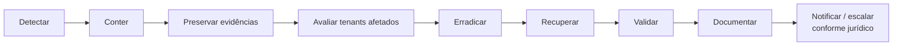

# Resposta a incidentes — W2Health

> Procedimento técnico. **Prazos e obrigações legais de notificação** (ANPD, titulares,
> clientes) **não** são definidos aqui: dependem de avaliação jurídica e dos contratos com
> cada operadora. Este documento indica o ponto do fluxo em que o jurídico/DPO é acionado.

## Papéis
| Papel | Responsabilidade |
|---|---|
| Coordenador do incidente | decide contenção, mantém a linha do tempo, comunica |
| Engenharia | investiga, contém, corrige, restaura |
| Segurança | preserva evidências, avalia vetor e escopo |
| Encarregado (DPO) / jurídico | avalia obrigação de notificação e prazos; aprova comunicações externas |
| Contato de cada cliente afetado | recebe comunicação conforme contrato |

## Severidade (proposta inicial)
| Nível | Exemplos |
|---|---|
| S1 | suspeita de acesso cruzado entre tenants; vazamento de dado de beneficiário; credencial de plataforma comprometida |
| S2 | indisponibilidade total; perda de dado recuperável; falha de reconciliação em carga homologada |
| S3 | degradação; falha de carga isolada; vulnerabilidade sem exploração conhecida |

## Fluxo

1. **Detectar** — alertas (runbook), auditoria (`access.denied`, `auth.refresh_reuse_detected`,
   `auth.account_locked`, `platform.tenant_access`), relato de cliente, achado de scan.
   Abrir registro com hora, quem detectou e evidência inicial.
2. **Conter** — conforme o vetor: suspender tenant ou usuário; revogar sessões (reset de
   senha/MFA ou troca da `JWT_SECRET_KEY`, que derruba todas); bloquear origem no proxy;
   desativar fonte de dados; parar o worker (a fila preserva os jobs); rotacionar credenciais
   ([OPERATIONS_RUNBOOK.md](OPERATIONS_RUNBOOK.md) §12).
3. **Preservar evidências** — exportar logs do período (JSON com `request_id`, `tenant_id`,
   `user_id`), `audit_logs` (append-only para a aplicação), snapshot do banco e do bucket,
   imagens/versões em execução. Não alterar dados antes da cópia. Registrar cadeia de custódia.
4. **Avaliar tenants afetados** — por `tenant_id` nos logs/auditoria; consultas de acesso a
   dado individual (`data.beneficiary.*`); cargas (`pipeline.*`); quais categorias de dado
   (pseudonimizado? financeiro? identificador?) e período.
5. **Erradicar** — corrigir a causa (patch, configuração, credencial), com teste que reproduz
   o problema; scan de dependências.
6. **Recuperar** — restaurar banco/tenant se necessário (DR completo ou restauração lógica por
   tenant — [BACKUP_AND_RECOVERY.md](BACKUP_AND_RECOVERY.md)); reativar serviços.
7. **Validar** — suíte de testes de isolamento/segurança, `/health/ready`, reconciliação das
   cargas afetadas, conferência com o cliente quando houver dado envolvido.
8. **Documentar** — linha do tempo, causa raiz, impacto por tenant, ações, lições; itens no roadmap.
9. **Notificar / escalar** — o DPO/jurídico decide, com base nos fatos do passo 4, quem notificar,
   como e em que prazo. Nenhuma comunicação externa sem essa aprovação.

## Pós-incidente
Revisão sem culpados em até alguns dias; atualizar [THREAT_MODEL_V1.md](THREAT_MODEL_V1.md),
runbook e testes.
