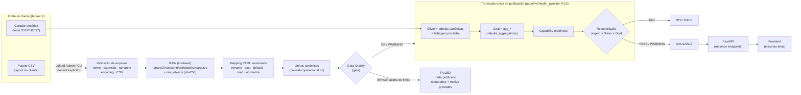
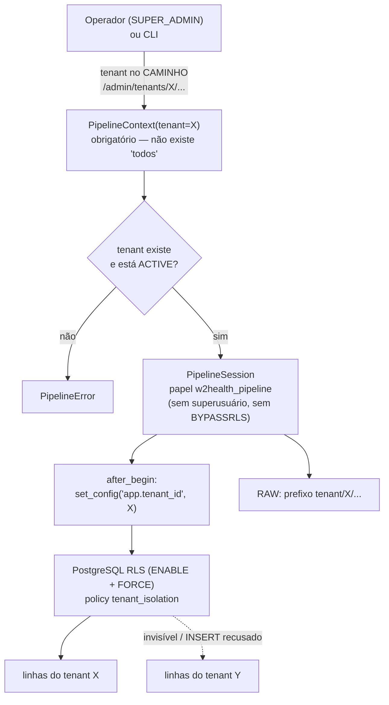
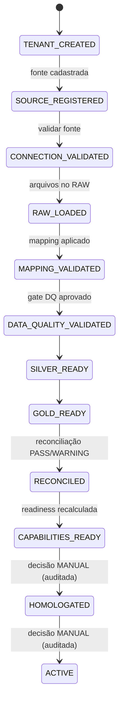
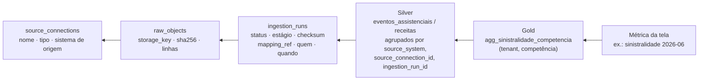
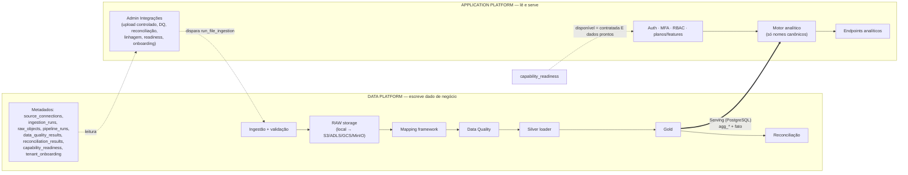

# Fase 2 — Fundação Operacional de Integração (Data Platform)

> **O que esta fase prova:** um tenant pode ser alimentado por uma fonte externa
> (pacote CSV genérico) e o **mesmo** motor analítico, os **mesmos** endpoints e o **mesmo**
> frontend funcionam sem saber de onde o dado veio.
>
> `fonte externa → ingestão → RAW → mapping → canônico/Silver → Data Quality → Gold → Serving → FastAPI → frontend`
>
> **O que esta fase NÃO faz:** nenhum conector MV/Tasy/Benner/Datasul, nenhum campo
> inventado de sistema real, sem Kafka/K8s/Airflow/Spark/ML/LLM/forecast/reajuste. Cloud-agnostic.

Linha de base: [PHASE2_BASELINE.md](PHASE2_BASELINE.md). Documentos de detalhe:

| Tema | Documento |
|---|---|
| Arquitetura do pipeline (papéis, transações, estágios) | [PIPELINE_ARCHITECTURE.md](PIPELINE_ARCHITECTURE.md) |
| Ingestão de arquivo, idempotência, upload controlado | [INGESTION_FRAMEWORK.md](INGESTION_FRAMEWORK.md) |
| RAW storage (abstração, chaves, imutabilidade) | [RAW_STORAGE.md](RAW_STORAGE.md) |
| Mapping declarativo SOURCE → canônico | [MAPPING_FRAMEWORK.md](MAPPING_FRAMEWORK.md) |
| Linhagem métrica → Silver → ingestão → RAW → fonte | [DATA_LINEAGE.md](DATA_LINEAGE.md) |
| Reconciliação origem × Silver × Gold | [RECONCILIATION.md](RECONCILIATION.md) |
| O que pedir ao cliente | [CLIENT_DATA_REQUIREMENTS.md](CLIENT_DATA_REQUIREMENTS.md) · [SOURCE_DISCOVERY_TEMPLATE.md](SOURCE_DISCOVERY_TEMPLATE.md) |
| Onboarding técnico (20 passos) | [CLIENT_ONBOARDING.md](CLIENT_ONBOARDING.md) |
| Capability readiness (contratada × dados prontos) | [CAPABILITY_READINESS.md](CAPABILITY_READINESS.md) |
| Dependências, backup | [DEPENDENCY_SECURITY.md](DEPENDENCY_SECURITY.md) · [BACKUP_AND_RECOVERY.md](BACKUP_AND_RECOVERY.md) |

## 1. Fluxo completo de dados

## 2. Isolamento multi-tenant do pipeline

Garantias testadas (`backend/tests/test_pipeline_e2e.py`): a sessão de pipeline sem tenant
falha fechada (`test_pipeline_sem_tenant_falha`); o papel de pipeline não tem privilégio e
opera sob RLS (`test_papel_de_pipeline_sem_privilegio_e_sob_rls`); a fonte de outro tenant
não é utilizável (`test_fonte_de_outro_tenant_nao_e_utilizavel`); o mesmo código de negócio
em dois tenants não colide e a sinistralidade de A nunca contém valores de B
(`test_mesmos_ids_de_negocio_nos_dois_tenants_sem_colisao`,
`test_sinistralidade_de_a_nunca_contem_valores_de_b`).

## 3. Onboarding técnico do cliente

Estados automáticos só avançam (nunca regridem); `HOMOLOGATED` e `ACTIVE` são decisões
humanas registradas com nota e autor. Checklist operacional: [CLIENT_ONBOARDING.md](CLIENT_ONBOARDING.md).

## 4. Linhagem

Cada linha canônica carrega `source_system`, `source_connection_id`, `ingestion_run_id` e
`source_record_id`. Detalhe: [DATA_LINEAGE.md](DATA_LINEAGE.md).

## 5. Data Platform × Application Platform

| | Papel de banco | Escreve | Lê |
|---|---|---|---|
| Migrations / CLI administrativa | `w2health` (dono) | schema | — |
| API (runtime) | `w2health_app` | configuração, auditoria, readiness, cadastro de fontes | data plane do tenant da sessão |
| Pipelines | `w2health_pipeline` | data plane + metadados de ingestão do tenant do contexto | só o tenant do contexto |

## 6. Dois caminhos, uma linhagem

| Caminho | Fonte registrada | Ingestão | Linhagem nas linhas |
|---|---|---|---|
| **A — sintético** (`app.seed.run`) | `SYNTHETIC` "Gerador sintético W2Health" | `ingestion_runs` SUCCESS/AVAILABLE | `source_system=synthetic_generator` |
| **B — arquivo do cliente** (Admin ou CLI) | `FILE` com mapping versionado | RAW → … → AVAILABLE | `source_system` da fonte (ex.: `generic_csv`) |

Os dois terminam nas **mesmas** tabelas Silver e no **mesmo** `rebuild_aggregations`
(restrito à janela de dados do tenant). O motor e os endpoints não têm `if origem == …`.

## 7. Demonstração

Tenant `vida-plena-csv` — "Operadora Vida Plena (fonte CSV)" — alimentado só pelo pacote
`data_platform/examples/generic_operator/pacote/` (1.000 beneficiários, 18 competências,
12.093 eventos, layout fictício com `;`, decimal `,` e datas `dd/mm/aaaa`). Roteiro em
[DEMO.md](DEMO.md) §Fase 2.

## 8. Pendências honestas (fora desta fase)

- ~~Adapter de object storage real~~ — **resolvido na Fase 3** (adapter S3-compatível; Azure/GCS seguem como adapters futuros).
- Conectores DATABASE/API: o cadastro aceita o tipo e a referência de segredo; **não há
  extração** implementada (validação de conectividade responde "não implementado").
- Orquestração agendada: execução é sob demanda (upload/CLI). Sem agendador.
- ~~Pipeline síncrono na requisição de upload~~ — **resolvido na Fase 3** (fila + worker —
  [WORKER_AND_QUEUE.md](WORKER_AND_QUEUE.md)).
- Backup de produção **não existe**; existem o teste local de backup/restore e a
  restauração por tenant ([BACKUP_AND_RECOVERY.md](BACKUP_AND_RECOVERY.md)).
- ~~Vulnerabilidades conhecidas em dependências~~ — **resolvido na Fase 3** para tudo que vai
  ao runtime ([DEPENDENCY_SECURITY.md](DEPENDENCY_SECURITY.md)).
