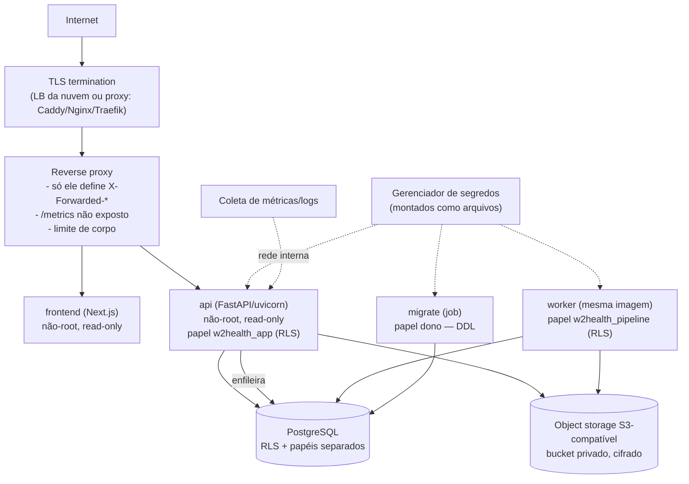

# Deployment de produção — W2Health (Fase 3)

> Provider-neutral. Nenhuma nuvem foi escolhida. O arquivo
> [`docker-compose.production.example.yml`](../docker-compose.production.example.yml) é uma
> **referência executável** (validada localmente — §8), não a decisão de plataforma.

## 1. Arquitetura

| Componente | Rede | Exposto à internet |
|---|---|---|
| proxy | edge | sim (443) |
| frontend, api | edge + interna | só via proxy |
| worker, migrate | interna | não |
| PostgreSQL, object storage | interna | não (nenhuma porta publicada) |

## 2. Configuração por ambiente

`ENVIRONMENT` ∈ `development`, `test`, `staging`, `production` (outro valor não sobe;
`local`/`docker` são aliases históricos de development). **Staging e production são
fail-closed** — API e worker recusam iniciar se qualquer item faltar ou for inseguro
(`Settings.validate_for_runtime`, testado em `test_phase3_security.py`):

| Item | Regra em produção |
|---|---|
| `JWT_SECRET_KEY` | ≥ 32 caracteres |
| `DATA_ENCRYPTION_KEY` | chave(s) Fernet válidas (MFA e cofre de segredos) |
| `COOKIE_SECURE` / `COOKIE_SAMESITE` | `true` / `strict` ou `lax` |
| `CORS_ORIGINS` | lista explícita, somente `https://`, sem `*` |
| `TRUSTED_HOSTS` | hosts públicos explícitos, sem `*` |
| `FORWARDED_ALLOW_IPS` | IP(s) do proxy; `*` proibido |
| `SUPER_ADMIN_REQUIRE_MFA` | `true` |
| `RATE_LIMIT_BACKEND` | `database` (compartilhado entre réplicas) |
| `LOG_FORMAT` | `json` |
| `DATABASE_URL` / `DATABASE_ADMIN_URL` / `DATABASE_PIPELINE_URL` | os três presentes, runtime ≠ dono, sem credencial de exemplo nem host local |
| `RAW_STORAGE_BACKEND` | `s3` com `S3_BUCKET`; `local` só com `RAW_STORAGE_ALLOW_LOCAL_IN_PRODUCTION=true` |
| `/docs`, `/openapi.json` | desligados |
| `METRICS_TOKEN` | sem token, `/metrics` responde 404 |
| HSTS | ligado automaticamente (`HSTS_ENABLED` para forçar) |

## 3. Segredos

* A aplicação lê segredos de variáveis de ambiente **ou** de arquivos em `SECRETS_DIR`
  (um arquivo por campo, ex.: `/run/secrets/jwt_secret_key`) — o formato que Docker/Kubernetes
  secrets, AWS Secrets Manager (CSI/agent), Azure Key Vault (CSI) e Vault Agent entregam.
  O código não conhece o provedor.
* Segredos de **integração por tenant** (credenciais de banco/API de clientes): cofre do
  tenant no banco, cifrado com Fernet (`tenant:<chave>`); `env:` proibido em produção;
  `vault:` reservado para um `SecretProvider` de nuvem (não implementado). Nunca voltam pela
  API, nunca vão para log/auditoria (`test_segredo_nunca_aparece_na_api_nem_nos_logs`).
* Nada de segredo na imagem: `.env` fora do contexto de build (`.dockerignore`), sem `ARG`
  secreto; `NEXT_PUBLIC_API_BASE_URL` é público por natureza.
* Rotação: JWT (troca de chave derruba sessões — fazer em janela), Fernet (várias chaves
  separadas por vírgula: a 1ª cifra, todas decifram), senhas de papéis (ALTER ROLE + troca do
  arquivo + restart) — [OPERATIONS_RUNBOOK.md](OPERATIONS_RUNBOOK.md) §Rotação.

## 4. Containers

| Imagem | Base | Usuário | Conteúdo |
|---|---|---|---|
| backend (API e worker) | `python:3.12-slim-bookworm`, multi-stage | 10001 (não-root) | venv só com dependências de runtime; sem compiladores, pytest, ruff, testes ou `.env`; código pertence a root (somente leitura) |
| backend `--target test` | runtime + deps de dev + testes | 10001 | só CI / `make test` |
| frontend | `node:20-alpine`, multi-stage, Next standalone | 10001 | sem node_modules de dev, sem fonte, sem source maps públicos |

No compose de referência: `read_only: true`, `tmpfs: /tmp`, `cap_drop: [ALL]`,
`no-new-privileges`. Healthchecks: API `GET /health/live`; worker `python -m app.worker
healthcheck` (heartbeat do loop); frontend `GET /`. Versões travadas por lock
(`uv.lock` → `requirements*.txt`, `package-lock.json`); fixar digest das imagens base no
registro da empresa é recomendado.

## 5. Proxy e TLS

* TLS termina no proxy/LB; HSTS enviado pelo proxy e pela aplicação.
* O IP do cliente é aceito de `X-Forwarded-For` **somente** quando a conexão chega de um IP
  em `FORWARDED_ALLOW_IPS` (uvicorn `--proxy-headers`). A aplicação nunca lê o cabeçalho
  por conta própria (rate limit e auditoria não são falsificáveis —
  `test_ip_do_cliente_nao_vem_de_x_forwarded_for_na_aplicacao`).
* `Host` fora de `TRUSTED_HOSTS` → 400 (health liberado para probes internos).
* `/metrics` bloqueado no proxy; coletado pela rede interna com token.
* Limite de corpo no proxy coerente com `UPLOAD_MAX_FILE_MB × UPLOAD_MAX_FILES`.

## 6. Banco de dados

| Papel | Uso | Atributos | Privilégios |
|---|---|---|---|
| dono (migrations) | job `migrate` | idealmente NOSUPERUSER em banco gerenciado | DDL |
| `w2health_app` | API | NOSUPERUSER NOBYPASSRLS NOCREATEDB NOCREATEROLE NOINHERIT; não é dono de nenhuma tabela; sem CREATE no schema | leitura do data plane; escrita só onde necessário; `audit_logs` só INSERT; fila só SELECT |
| `w2health_pipeline` | worker / recepção de carga | idem | escrita no data plane do tenant (RLS), fila; sem acesso a usuários, sessões, segredos, recovery codes |

27 tabelas com RLS `ENABLE + FORCE`. Verificado em `test_papeis_de_runtime_e_pipeline_com_menor_privilegio`.
Migrations rodam **antes** da troca de versão, num job separado; a API não tem DDL.

## 7. Atualização de versão (procedimento)

1. Backup (snapshot/PITR do banco + objeto storage versionado).
2. `migrate` com a nova imagem (`alembic upgrade head`) — migrations são aditivas.
3. Trocar `worker` (SIGTERM termina o job atual; jobs interrompidos são recuperados pelo lease).
4. Trocar `api` e `frontend` (rolling).
5. Verificar `/health/ready`, fila (`w2h_queue_depth`), erros (`w2h_http_requests_total{status="5xx"}`).

> **Nota de upgrade desta fase**: as imagens agora rodam como uid 10001. Volumes criados por
> versões anteriores (que rodavam como root) precisam de `chown -R 10001:10001` no diretório
> do RAW local antes do primeiro start — sem isso a API responde 503 "armazenamento
> indisponível" no upload (comportamento observado e corrigido no ambiente local).

## 8. Validação local do deployment de referência (2026-10-06)

| Verificação | Resultado |
|---|---|
| `migrate` a partir de banco vazio (cadeia completa até `b8e9f0a1c2d3`) | OK |
| `/health/ready` via proxy TLS | `database ok · pipeline_database ok · object_storage ok` |
| Headers API / frontend via proxy | HSTS, CSP, X-Frame-Options, nosniff presentes |
| `/metrics` pela internet | 404 no proxy; interno com token OK |
| Host desconhecido | recusado |
| Processos | api, worker, frontend com uid 10001 |
| Carga real enfileirada → **serviço worker** processou | SUCCESS, 1 tentativa, 2.912 registros, 8 objetos RAW no bucket S3 |
| Export/verify/import do tenant (RAW vindo do S3) | OK |
| API com `TRUSTED_HOSTS=*` / worker com CORS `http://` | **não sobem** (fail-closed) |
