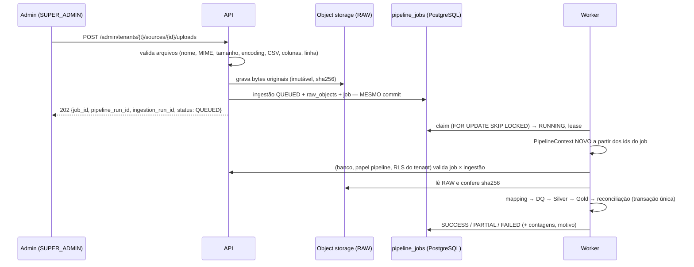

# Worker e fila do pipeline — W2Health (Fase 3)

Código: `backend/app/worker/` (fila, serviço, ações administrativas) e
`backend/app/data_platform/runner.py` (`receive_package` / `process_ingestion`).

## 1. Fluxo assíncrono



A API responde em ~1 s para um pacote de 300 beneficiários e ~3 s para 5,4 MB / 64.500
registros (medido — [PERFORMANCE_BASELINE.md](PERFORMANCE_BASELINE.md)). O processamento
nunca acontece na requisição.

## 2. Decisão de tecnologia: PostgreSQL como fila

| Opção | Avaliação |
|---|---|
| **PostgreSQL (`FOR UPDATE SKIP LOCKED`)** — escolhida | Sem componente novo. Enfileirar é transacional com a ingestão (padrão *outbox*: não existe job sem RAW, nem ingestão sem job). Durável, auditável, visível no Admin por SQL. Várias réplicas de worker sem disputa (`SKIP LOCKED`). Volume esperado (dezenas de cargas/dia por cliente) é ordens de grandeza abaixo do limite do padrão. |
| Celery / RQ / ARQ + Redis | Maduros, mas exigem Redis (mais um serviço para operar, proteger, fazer backup e monitorar) e perdem a atomicidade "ingestão + job" sem um outbox adicional. Ganho só apareceria com milhares de jobs/minuto. |
| Kafka / SQS / Service Bus | Fora do escopo (overengineering para o estágio atual); dependem de nuvem escolhida. |

O domínio depende só do protocolo `JobQueue` (`claim`, `heartbeat`, `finish`,
`retry_later`, `reap`, `depth`). Trocar por Redis/RQ ou SQS = novo adapter, sem tocar no
pipeline. Rate limit também é compartilhado no PostgreSQL — Redis não é necessário.

## 3. O que o job carrega

Somente ids técnicos: `tenant_id`, `source_connection_id`, `ingestion_run_id`,
`pipeline_run_id` (+ tentativas, lease, erro seguro, contagens agregadas). **Nenhum** byte de
arquivo, linha ou dado assistencial. A tabela não tem RLS (o worker precisa ler a fila antes
de ter tenant); por isso o worker **revalida tudo sob RLS** do tenant do job.

## 4. Isolamento no worker (crítico)

1. Cada job constrói um `PipelineContext` novo (`runner.job_context`) — nada herdado.
2. O contexto de log é **substituído** por job (`fresh_log_context`).
3. Sessões novas, amarradas ao tenant do job; o tenant vai ao PostgreSQL por
   `set_config('app.tenant_id', …, true)` — local à transação; conexão do pool não leva tenant.
4. Job × banco: a ingestão e o pipeline_run do job precisam existir **no tenant do job**
   (RLS) e casar com a fonte. Job adulterado (tenant B apontando ingestão de A) →
   `FAILED`, classe `definitive`, motivo `integrity`, sem tocar em nada.
5. RAW lido é conferido com o sha256 gravado na recepção.

Testes: `test_worker_nao_vaza_contexto_entre_tenants_a_b_a` (A → B → A no mesmo processo,
logs e linhas conferidos), `test_job_adulterado_com_tenant_diferente_falha_sem_tocar_dados`,
`test_cargas_concorrentes_a_b_isoladas_e_processadas_uma_vez` (3 workers em paralelo,
mesmos códigos de negócio em A e B).

## 5. Estados (uma máquina, um vocabulário)

`QUEUED → RUNNING → SUCCESS | PARTIAL | FAILED | CANCELLED` — o mesmo vocabulário em
`ingestion_runs.status` e `pipeline_jobs.status`. A ingestão diz o desfecho do **dado**; o
job acrescenta **tentativas, lease e erro técnico**. Estágio da carga (RECEIVED → … →
AVAILABLE) continua em `ingestion_runs.stage`.

## 6. Retry, idempotência e falhas

| Situação | Classe | Comportamento |
|---|---|---|
| Banco indisponível, object storage indisponível, timeout, erro inesperado | `retryable` | volta a `QUEUED` com backoff `base × 2^(n-1)` (30 s, 60 s, 120 s…, teto 15 min) até `max_attempts` (3); depois `FAILED` "tentativas esgotadas" |
| Data Quality bloqueou, reconciliação reprovou | — (desfecho de negócio) | `FAILED` direto, 1 tentativa, motivo `dq_blocked` / `reconciliation_failed` |
| Mapping inválido, validação de arquivo, tenant inexistente/inativo, objeto RAW ausente, integridade (job ou sha256) | `definitive` | `FAILED` direto, sem retry |
| Job reentregue / reexecutado | — | ingestão já publicada → no-op `SUCCESS`; Silver usa UPSERT/snapshot por competência; DQ/reconciliação de tentativa anterior são limpos antes da nova |
| Mesmo job enfileirado duas vezes | — | `dedup_key` único recusa |
| Mesmo pacote reenviado | — | checksum → resposta imediata "idêntico à ingestão #N" (sem job) |

Testes: `test_falha_transitoria_entra_em_retry_e_conclui_sem_duplicar`,
`test_tentativas_esgotadas_terminam_em_failed`, `test_banco_indisponivel_no_meio_e_retentavel`,
`test_dq_bloqueio_registra_motivo`, `test_reconciliacao_fail_nao_publica`,
`test_mapping_invalido_apos_enfileirar_e_definitivo`, `test_job_duplicado_e_reexecucao_nao_duplicam_dados`.

## 7. Worker caído, travado, timeout (dead jobs)

* **Lease**: ao pegar um job o worker recebe um lease (`JOB_LEASE_SECONDS`, 600 s) renovado
  por uma thread a cada lease/3 **durante todo o job** (passo longo ≠ worker morto —
  `test_lease_e_renovado_durante_passo_longo`).
* **Reaper** (em todo worker, a cada ~lease/4): job `RUNNING` com lease vencido ou além de
  `JOB_MAX_RUNTIME_SECONDS` (3600 s) volta para a fila (com backoff) ou, sem tentativas,
  vira `FAILED` (`lease_expired`). Seguro com várias réplicas (`SKIP LOCKED`).
* Transação de publicação não confirmada quando o processo morre → nada publicado; a nova
  tentativa refaz do RAW (`test_worker_cai_no_meio_da_carga_e_e_recuperado`).
* **Admin → Integrações → Fila**: travados, mais antigo na fila, workers ativos; ações
  `Reexecutar` (só falha de infraestrutura ou job travado) e `Cancelar` (só `QUEUED`) —
  transições condicionais, auditadas (`pipeline.job_retry`, `pipeline.job_cancel`). Falha de
  DQ/mapping **não** é reexecutável: exige corrigir a origem e reenviar.
* Desligamento (SIGTERM): o worker termina o job atual e sai.

## 8. Operação

```bash
python -m app.worker              # loop (serviço `worker`)
python -m app.worker healthcheck  # 0 = heartbeat recente (healthcheck do contêiner)
python -m app.worker drain        # processa o que há na fila e sai
```

| Configuração | Padrão |
|---|---|
| `WORKER_POLL_SECONDS` | 2 |
| `JOB_MAX_ATTEMPTS` | 3 |
| `JOB_BACKOFF_BASE_SECONDS` / `JOB_BACKOFF_MAX_SECONDS` | 30 / 900 |
| `JOB_LEASE_SECONDS` | 600 |
| `JOB_MAX_RUNTIME_SECONDS` | 3600 |

Escala: N réplicas do worker (cada uma processa 1 job por vez). Métricas: `w2h_queue_depth`,
`w2h_queue_oldest_seconds`, `w2h_jobs{status}`, `w2h_jobs_stuck`, `w2h_job_retries_total`,
`w2h_job_duration_seconds`, `w2h_workers_alive` ([OPERATIONS_RUNBOOK.md](OPERATIONS_RUNBOOK.md)).
